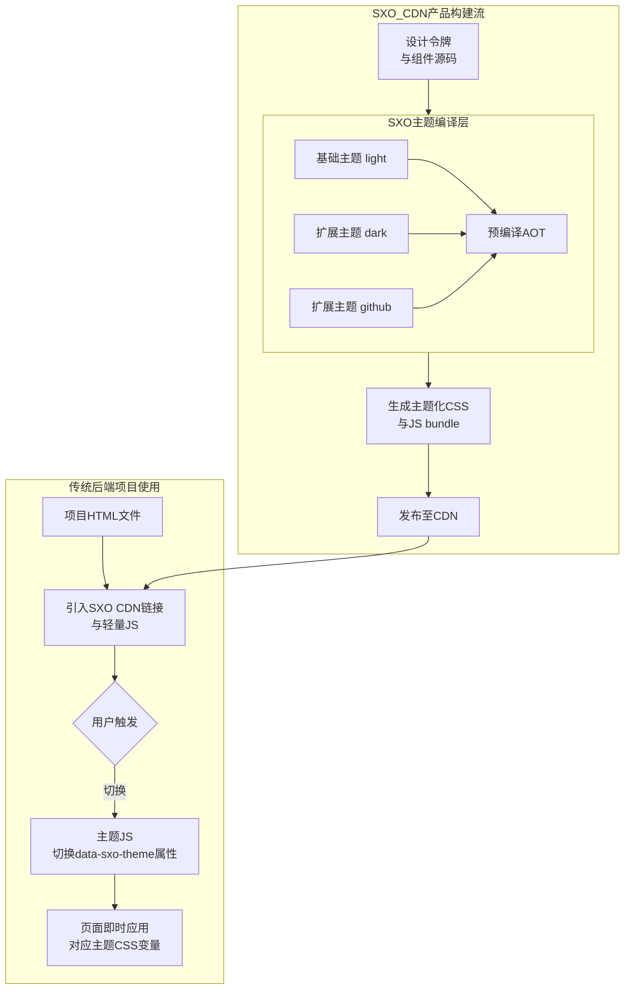

# 📦 CDN Bundle：现代化即用型方案

SXO 提供了一个专门的产品形态 **`@sxo/bundle`**。它的核心定位是：**“一个链接，替换 BS3，获得现代化体验”**。

## 一、产品定位

这是一个 AOT 编译、CDN 分发、支持动态主题的 Bootstrap 3 直接替代品。它专为以下场景设计：
- 不希望接触任何构建工具的后端开发者。
- 需要快速原型化的全栈项目。
- 传统的 CMS 或静态站点（如 Hexo, Hugo）。

## 二、架构与工作流程



## 三、核心设计原理

`@sxo/bundle` 是一个独立的 NPM 包，其唯一职责是将 `@sxo/ui` 的组件样式和逻辑与主题系统预先编译（AOT）成静态资源。

### 1. 产出物
*   **`sxo-core.css`**：核心结构样式，包含所有组件的不变盒模型。
*   **`sxo-theme-[name].css`**：各个主题的 CSS 变量定义（如 `sxo-theme-github.css`）。
*   **`sxo.js`**：极小运行时（< 5KB），负责主题切换与初始化。

### 2. 关键技术
- **CSS 变量分离**：所有颜色、间距等值均抽离为变量，实现无刷新换肤。
- **AOT 编译**：在构建阶段预先生成所有工具类样式，确保极致压缩。
- **零依赖运行时**：Vanilla JS 驱动，无需 jQuery 或其他框架。

## 四、快速开始

在您的 HTML 中直接引入 CDN 链接：

```html
<!-- 1. 核心结构样式 -->
<link rel="stylesheet" href="https://cdn.sxoui.com/sxo-core.css">

<!-- 2. 主题变量定义 (可多选) -->
<link rel="stylesheet" href="https://cdn.sxoui.com/sxo-theme-github.css">
<link rel="stylesheet" href="https://cdn.sxoui.com/sxo-theme-pornhub.css">

<!-- 3. 轻量运行时 -->
<script src="https://cdn.sxoui.com/sxo.js"></script>

<script>
  // 初始化并切换主题
  SXO.setTheme('github');
</script>
```

## 五、与 Bootstrap 3 对比

| 特性 | Bootstrap 3 | SXO Bundle |
| :--- | :--- | :--- |
| **依赖** | 依赖 jQuery | **无任何依赖** |
| **主题** | 修改 LESS 重新编译 | **动态 CSS 变量，秒级切换** |
| **性能** | 全量引入，体积较大 | **AOT 生成，支持按需加载** |
| **定制** | 深耦合，定制困难 | **基于变量，定制极其简单** |
| **现代化** | 样式与模式较旧 | **现代 CSS 特性，视觉更新** |

## 六、集成指南

针对不同技术栈，我们提供了详细的集成文档：

- 🛠️ [Hexo / 静态站点集成](../adaptors/hexo.md)
- ☕ [Java (Spring Boot/Thymeleaf) 集成](../adaptors/index.md)
- 🌐 [框架适配器概览](../adaptors/index.md)
